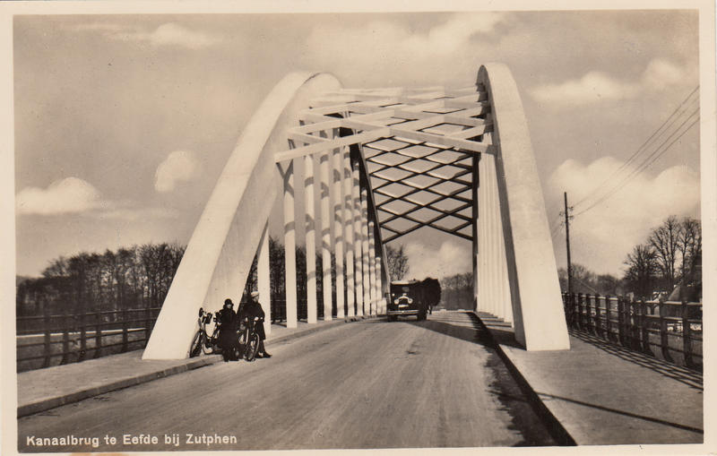

# Een Eeuw Eefde

Compilatie van oude foto's van Eefde door Dirk Roorda. 
Elke foto bevat een beschrijving, GPS coordinaten van de waar hij genomen is, en de datum waarop hij genomen is.

Zowel datum en plaats zijn niet altijd even nauwkeurig bekend, daarom is er vaak een (ruwe) schatting gemaakt.

## Bron

Alle foto's (hm... bijna alle) zijn gedownload van de
[Beeldbank Erfgoedcentrum Zutphen](https://erfgoedcentrumzutphen.nl/onderzoeken/beeldbank)
(zoek op Eefde).

## Waar te zien?

Je kunt online door de Eefdese eeuw reizen op 
[Flickr](https://www.flickr.com/photos/leegerstee/albums).

Je kunt bij de foto's opmerkingenschrijven.
Met name correcties met betrekking tot de plaats, tijd, en omschrijving van de foto's worden zeer op prijs gesteld.

*Tip voor tablet of telefoon*: Neem een gratis Flickr account en gebruik de Flickr app.

## Downloaden

Alle foto's staan op
[Dropbox](https://www.dropbox.com/sh/u4tvuib9d5sco2q/AAAkkSq0_iveegH-kEKO1vcaa?dl=0).
Via deze link kun je de hele verzameling in één keer downloaden.
Je krijgt ze dan netjes geordend in mappen op je computer.

*Tip voor tablet of telefoon*:
Je kunt de foto's ook via direct bekijken via deze link.
Je krijgt dan ook de locaties te zien.
Helaas laat Dropbox niet de beschrijvingen zien.

## Volgende stap

De beste ervaring krijg je als je de foto's importeert in je eigen foto programma.

Je vindt ze misschien niet meteen terug, omdat de datums van de foto's ver in het verleden liggen.

Zoek dan op *keyword*: ze hebben allemaal de keywords **historisch** en **Eefde**.

Voor het geval dat de folderstructuur niet doorgekomen is bij het importeren in je fotoprogramma:
elke foto heeft ook de straatnaam als keywoord, bv **kapperallee** of **boedelhofweg**.

Ook zijn er de keywords 

* **sluis**
* **kanaal**
* **Spoorbrug**
* **huisdevoorst**
* **mettray**
* **laatstestuiver**
* **kazerne**
* **kerk**
* **kaart**.
